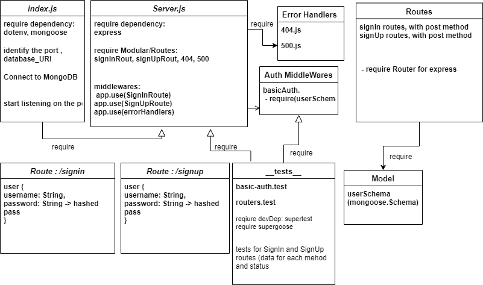

# basic-auth

### Author: Nihad Zeidan

### tests report:

[Heroku](https://nihad-auth.herokuapp.com)

[GitHub PR](https://github.com/NihadZeidan/basic-auth/pull/1)

[GitHub Actions](https://github.com/NihadZeidan/basic-auth/actions)

### .env requirements

PORT - Port Number

DataBase_URI=mongodb://localhost:27017/auth

### Running the app
`npm start`

### Endpoints: 

`/signin`

`/signup`

Returns Object

{
  user {
    "username": "String",
    "password": "String",
  }
}

### Tests
Unit Tests: npm test

### UML

